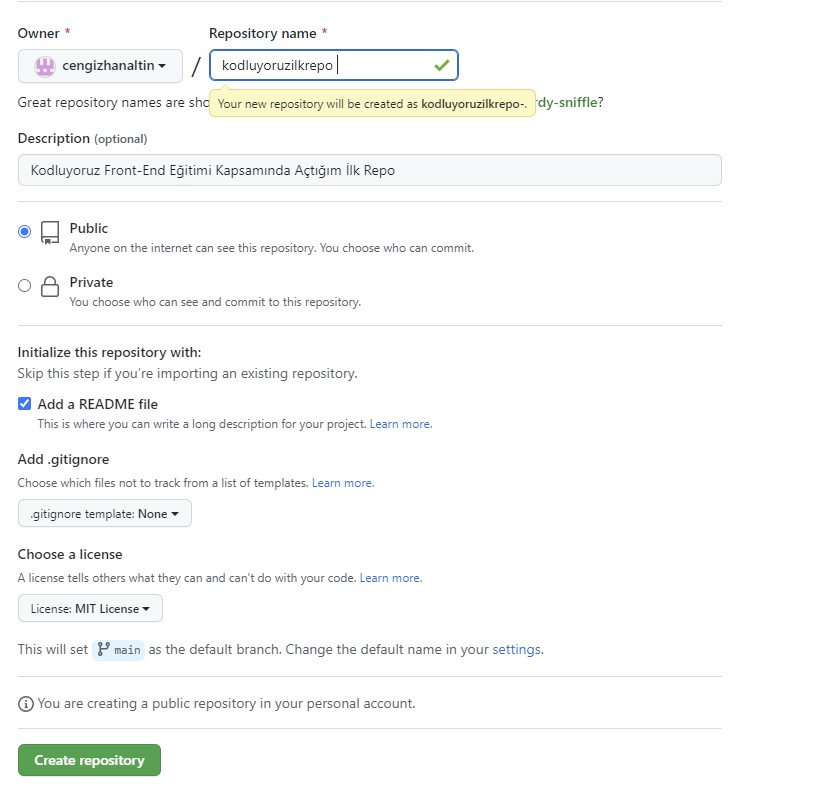

# KODLUYORUZ İLK REPO

------------------------------

Bu repo [Kodluyoruz](https://kodluyoruz.org/tr/kodluyoruz/) Front-End Eğitiminde oluşturduğumuz ilk repo. İçerisinde README dosyası, bir adet index.html barındırıyor.



## Installation
-------------------------------


Öncelikle projeyi clonelayın.(Buraya sizin reponuzdan aldığınız link gelecek)

```
git clone https://github.com/cengizcmataraci/kodluyoruzilkrepo.git

```

## Usage

--------------------------------

Projeyi cloneladıktan sonra Visual Studio Code programında açınız.

Linux için:

```
cd kodluyoruzilkrepo
code .
```

## Contributing

---------------------------------

Pull requestler kabul edilir. Büyük değişiklikler için, lütfen önce neyi değiştirmek istediğinizi tartışmak için bir konu açınız.

## License

-----------------------------------

[MIT](https://en.wikipedia.org/wiki/MIT_License)

## Patika
----------------------------------

```
https://app.patika.dev/cengo
```